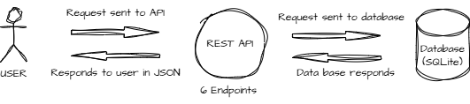

# readEmployeeDB
This project manages employee records in a database. A user can view, update, or delete employee records via API calls, as seen in the image:



The records are saved in an SQLite database included in the `readEmployeedb/db/employeedb.db` file and is included in this repository.

## Getting Started
Install project requirements by running this command:
```sh
poetry install # To install requirements
```
Next, run the application using:
```sh
poetry run fastapi run reademployeedb/main.py
```

# API description
We have the following endpoints:

### GET /employees
This endpoint returns a list of all employees in the database.
Example response:
```json
{
    "employees": [
        {
            "id": 1,
            "name": "John Doe",
            "department": "Engineering",
            "email": "john.doe@gmail.com",
            "phone": "1234567890"
        },
        {
            "id": 2,
            "name": "Jane Doe",
            "department": "Engineering",
            "email": "jane.doe@gmail.com",
            "phone": "1234567890"
        }
    ]
}
```

### GET /employees/{employee_id}
This endpoint returns the details of a single employee.
Example response:
```json
{
    "employee": {
        "id": 1,
        "name": "John Doe",
        "department": "Engineering",
        "email": "john.doe@gmail.com",
        "phone": "1234567890"
    }
}
```

### POST /employees/new
This endpoint creates a new employee record.
Example request:
```json
{  
    "id": 1,
    "name": "John Doe",
    "department": "Engineering",
    "email": "john.doe@gmail.com",
    "phone": "1234567890"
}
```
Example response:
```json
{"message": "Employee added successfully"}
```

### PUT /employees/update
This endpoint updates the details of an existing employee.
Example request:
```json
{  
    "id": 1,
    "name": "John Doe",
    "department": "Engineering",
    "email": "ohn.doe@gmail.com",
    "phone": "1234567890"
}
```
Example response:
```json
{"message": "Employee details updated successfully"}
```

### DELETE /employees/delete/{employee_id}
This endpoint deletes an employee record.
Example response:
```json
{"message": "Employee record deleted successfully"}
```